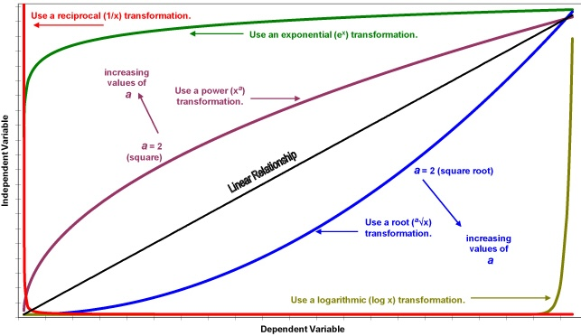

# Transform your Data!



This is an app that shows the effects of different transformations on your data.

We have implemented the following transformations:

- Logarithmic
- Polynomial
- Power Law
- Exponential

Article link: <>

Team members:


- [Adrian Lam Lorn Hin](https://www.linkedin.com/in/adrianlhlam/)
- [Benedict Neo](https://www.linkedin.com/in/benedictneo/)
- [Nicholas Barsi-Rhyne](https://www.linkedin.com/in/nicholas-barsi-rhyne-64a006204/)
- [Rebekah Zhou](https://www.linkedin.com/in/rebekahzhou/)

## setup

install requirements

```bash
pip install -r requirements.txt
```

run streamlit

```bash
streamlit run app/Home.py
```
